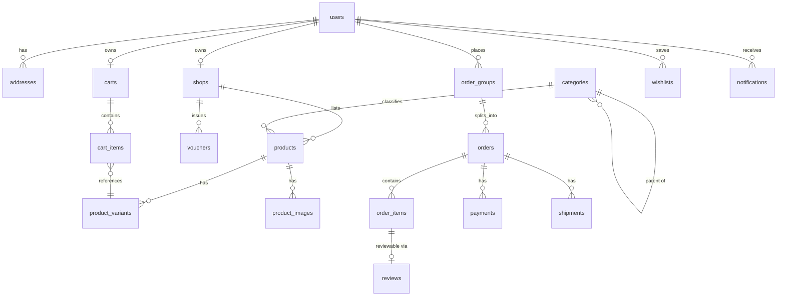

# ShopHub — DATABASE.md

Multi-vendor marketplace data model. Order-per-shop pattern: a buyer's cart spanning multiple shops splits into one `order` per shop, linked by `order_group`.

## Core Features

- `features/auth`: `users`
- `features/user`: `users`, `addresses`
- `features/shop`: `shops`
- `features/catalog`: `categories`, `products`, `product_images`, `product_variants`
- `features/cart`: `carts`, `cart_items`
- `features/order`: `order_groups`, `orders`, `order_items`, `payments`, `shipments`
- `features/review`: `reviews`
- `features/wishlist`: `wishlists`
- `features/voucher`: `vouchers`
- `features/notification`: `notifications`

---

## 1. Overview

- **Database:** PostgreSQL 15+ (primary store), Redis 7+ (session, cart cache, rate limiting — not source of truth)
- **ORM:** Prisma (recommended) or TypeORM — either works with feature-based module layout; pick one and keep schema files feature-scoped where the ORM allows
- **Naming conventions:**
  - Tables: `snake_case`, plural (`order_items`)
  - Columns: `snake_case` (`created_at`, `shop_id`)
  - Enums (PG types): `snake_case` singular (`order_status`)
  - Indexes: `idx_<table>_<column(s)>`
  - Foreign keys: `<referenced_table_singular>_id` (`shop_id`, `buyer_id`)

---

## 2. Entities by Feature

### Feature: auth / user
| Table | Key Fields | Notes |
|---|---|---|
| `users` | `id` PK, `email` UQ, `phone` UQ, `password_hash`, `full_name`, `role` (enum: buyer/seller/admin), `is_active`, `email_verified_at` | Single table for all roles at MVP scale |
| `addresses` | `id` PK, `user_id` FK→users, `recipient_name`, `phone`, `province`, `district`, `ward`, `detail_address`, `is_default` | 1:N per user |

### Feature: shop
| Table | Key Fields | Notes |
|---|---|---|
| `shops` | `id` PK, `owner_id` FK→users, `name`, `slug` UQ, `status` (enum: pending/approved/suspended/rejected), `rating_avg`, `total_sold` | Owner must have `role = seller` (app-level check) |

### Feature: catalog
| Table | Key Fields | Notes |
|---|---|---|
| `categories` | `id` PK, `parent_id` FK→categories (self-ref), `name`, `slug` UQ, `sort_order` | Multi-level tree; query via recursive CTE |
| `products` | `id` PK, `shop_id` FK→shops, `category_id` FK→categories, `name`, `slug` UQ, `status` (enum: draft/active/inactive), `rating_avg`, `sold_count` | |
| `product_images` | `id` PK, `product_id` FK→products, `url`, `sort_order` | 1:N |
| `product_variants` | `id` PK, `product_id` FK→products, `sku` UQ, `attributes` JSONB, `price`, `compare_at_price`, `stock_quantity` | `attributes` e.g. `{"color":"red","size":"L"}` — JSONB avoids schema churn per product category |

**Indexes:** `idx_products_shop(shop_id)`, `idx_products_category(category_id)`, `idx_products_status(status) WHERE status='active'`, `idx_variants_product(product_id)`, `idx_variants_attributes` (GIN on `attributes`)

### Feature: cart
| Table | Key Fields | Notes |
|---|---|---|
| `carts` | `id` PK, `user_id` FK→users (nullable = guest), `session_id` | Active cart mirrored in Redis for fast read/write; Postgres is durable backup |
| `cart_items` | `id` PK, `cart_id` FK→carts, `variant_id` FK→product_variants, `quantity`, UQ(`cart_id`,`variant_id`) | |

### Feature: order
| Table | Key Fields | Notes |
|---|---|---|
| `order_groups` | `id` PK, `buyer_id` FK→users | Groups sibling per-shop orders from one checkout |
| `orders` | `id` PK, `order_group_id` FK→order_groups, `order_code` UQ, `buyer_id` FK→users, `shop_id` FK→shops, `status` (enum), `payment_status` (enum), `subtotal`, `shipping_fee`, `total_amount`, `shipping_address` JSONB (snapshot) | One row per shop per checkout |
| `order_items` | `id` PK, `order_id` FK→orders, `product_id` FK→products, `variant_id` FK→product_variants, `product_name_snapshot`, `variant_attrs_snapshot` JSONB, `unit_price`, `quantity`, `subtotal` | **Never join `products` for display** — always read snapshot fields |
| `payments` | `id` PK, `order_id` FK→orders, `method`, `provider_txn_id`, `amount`, `status` (enum), `paid_at` | |
| `shipments` | `id` PK, `order_id` FK→orders, `carrier`, `tracking_number`, `status`, `shipped_at`, `delivered_at` | |

**Indexes:** `idx_orders_buyer(buyer_id)`, `idx_orders_shop(shop_id)`, `idx_orders_status(status)`

### Feature: review
| Table | Key Fields | Notes |
|---|---|---|
| `reviews` | `id` PK, `product_id` FK→products, `order_item_id` FK→order_items UQ, `user_id` FK→users, `rating` (1–5 CHECK), `comment`, `seller_reply` | UQ on `order_item_id` enforces "verified purchase, one review" |

### Feature: wishlist
| Table | Key Fields | Notes |
|---|---|---|
| `wishlists` | `id` PK, `user_id` FK→users, `product_id` FK→products, UQ(`user_id`,`product_id`) | |

### Feature: voucher
| Table | Key Fields | Notes |
|---|---|---|
| `vouchers` | `id` PK, `shop_id` FK→shops (nullable = platform-wide), `code` UQ, `type` (enum: percentage/fixed_amount), `value`, `min_order_amount`, `max_discount`, `usage_limit`, `used_count`, `starts_at`, `ends_at` | |

### Feature: notification
| Table | Key Fields | Notes |
|---|---|---|
| `notifications` | `id` PK, `user_id` FK→users, `title`, `content`, `type` (order_update/promotion/system), `reference_id`, `is_read` | `reference_id` is a loose pointer (order/product id), not a FK |

---

## 3. Relationships

- **Cross-feature relationships** (the exceptions to "no direct cross-feature imports"): `order_items` → `products`/`product_variants` (read-only, snapshot at write time), `reviews` → `order_items` (purchase verification). Model these as FK constraints at the DB level, but access them in code only through the owning feature's service/repository interface — never import another feature's entity/repository directly.
- Within a feature, standard FK relationships and direct repository access are fine.

---

## 4. Conventions

- **Primary keys:** `BIGSERIAL` (auto-increment). Simpler and more index-friendly than UUID for a single-DB monolith; revisit UUID only if/when features are extracted into separately-scaled services.
- **Soft delete:** not applied by default. Use `status` enums (`inactive`, `suspended`, `rejected`) for entities needing reversible hide/disable (`products`, `shops`, `users.is_active`). Add `deleted_at TIMESTAMPTZ` only where hard business need exists (e.g. GDPR-style user erasure requests).
- **Timestamps:** every table gets `created_at TIMESTAMPTZ NOT NULL DEFAULT now()`; mutable tables also get `updated_at TIMESTAMPTZ NOT NULL DEFAULT now()` maintained by ORM hook or `BEFORE UPDATE` trigger.
- **Enums:** native PostgreSQL `ENUM` types (`user_role`, `shop_status`, `product_status`, `order_status`, `payment_status`, `voucher_type`). Adding a value requires a migration (`ALTER TYPE ... ADD VALUE`); avoid encoding enums as free-text.
- **Money fields:** `NUMERIC(12,2)`, never `FLOAT`.
- **Snapshots:** any field copied into `order_items`/`orders` at transaction time is immutable after creation — do not backfill or sync from the live `products` row.

---

## 5. Migration Rules

- **Naming:** `<timestamp>_<verb>_<subject>` e.g. `20260801120000_create_products_table`, `20260805090000_add_compare_at_price_to_variants`.
- **Scope:** one logical change per migration; don't bundle unrelated tables.
- **Order:** respect FK dependency order — `users/addresses` → `categories/shops` → `products/product_images/product_variants` → `carts/cart_items` → `order_groups/orders/order_items/payments/shipments` → `reviews/wishlists` → `vouchers/notifications`.
- **Versioning:** rely on the ORM's migration history table (`_prisma_migrations` / TypeORM `migrations`) as the single source of truth; never hand-edit applied migrations.
- **Rollback policy:** every migration must define a working `down`. Destructive changes (drop column/table) ship as two-step migrations: (1) stop writing/reading the column in code, deploy, (2) drop it in a follow-up migration — never both in one deploy.
- **Search:** product full-text/filter search is served by Meilisearch/Elasticsearch synced from Postgres, not by querying Postgres directly in production.
