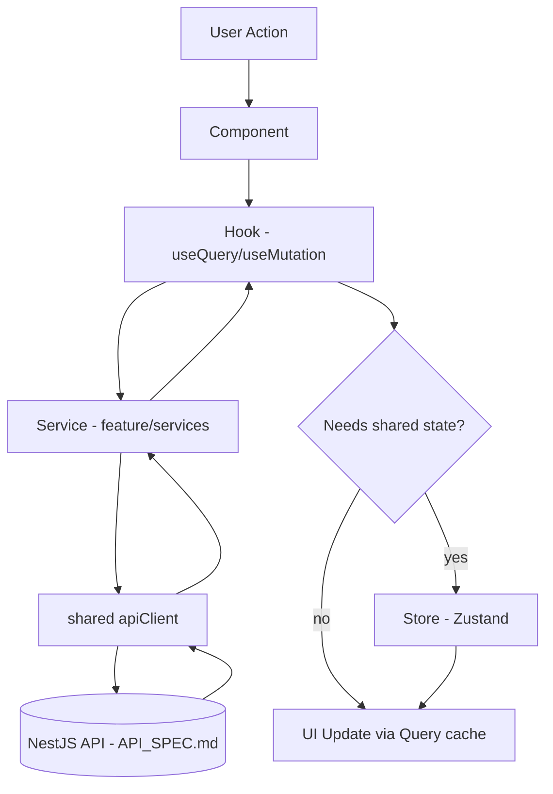
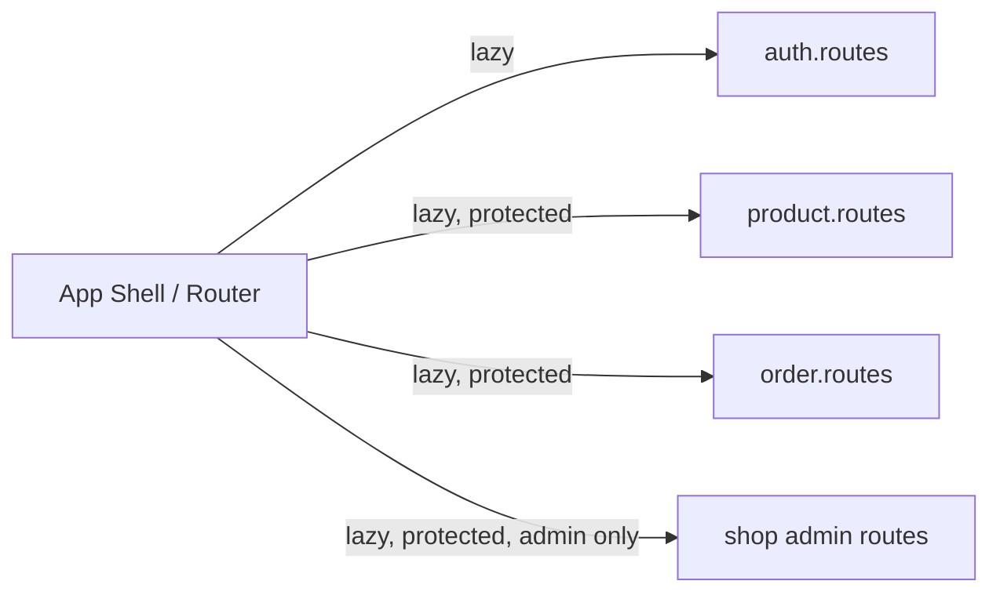

# ShopHub — Frontend ARCHITECTURE.md

Companion to `API_SPEC.md` (backend contract) and `PROJECT-RULES.md` (naming/coding rules). Covers structure and data flow for both frontend apps.

---

## 1. Overview

**Feature-based architecture:** code is organized by business capability (`product`, `cart`, `order`...) rather than by technical type (`components/`, `hooks/`, `services/` at the app root). This mirrors the backend's `features/` layout in `ARCHITECTURE.md` (BE) — the same mental model ("everything about checkout is in one place") applies on both sides, so a solo developer (and AI coding assistants) can move between BE and FE features with the same navigation instinct.

**Tech stack justification:**
- **Next.js (storefront):** SEO and first-load performance matter for a public product catalog — Server Components + SSR give fast, crawlable product/category pages without a separate SSR server.
- **React + Vite (dashboards):** seller/admin tools are behind auth, SEO-irrelevant, and benefit from Vite's fast dev/HMR loop over Next's SSR machinery the dashboards don't need.
- **TanStack Query:** the app's data is mostly server state (products, orders, cart) — Query gives caching, refetch, and loading/error states for free instead of hand-rolled `useEffect` fetching.
- **Zustand:** the *actual* client-only global state is small (session, cart badge, UI toggles) — a heavier store (Redux) would be overkill.
- **Tailwind:** fast iteration and consistent design tokens across two separate apps sharing a component philosophy without sharing a build.

---

## 2. Folder Structure

```
src/
├── app/                        # Next.js: app router tree | Vite: entry + router setup
│   ├── layout.tsx / main.tsx   # entry point, global providers mount here
│   ├── (routes)/                # Next.js route segments | Vite: routes.tsx config
│   └── providers/               # QueryClientProvider, ThemeProvider, AuthProvider
├── shared/
│   ├── components/              # Button, Modal, Input, Skeleton — no feature knowledge
│   ├── hooks/                   # useDebounce, useMediaQuery — generic, no API calls
│   ├── services/
│   │   └── api-client.ts        # Axios instance: base URL, auth header, 401 refresh, error envelope unwrap
│   ├── stores/
│   │   └── session.store.ts     # Zustand: user, auth status, cartItemCount
│   ├── types/                   # ApiResponse<T>, PaginatedMeta — mirrors API_SPEC.md envelope
│   └── utils/                   # formatCurrency, formatDate
├── features/
│   ├── auth/
│   ├── product/                 # catalog: listing, detail, variants
│   ├── cart/
│   ├── order/                   # checkout, order history, tracking
│   ├── shop/
│   ├── review/
│   ├── wishlist/
│   ├── voucher/
│   └── notification/
├── assets/                      # images, icons, fonts
└── styles/                      # tailwind.css, design tokens
```

- `shared/services/api-client.ts` is the **only** place Axios is configured — feature services import it, never instantiate their own client.
- `app/` composes features into routes/pages; it contains no business logic itself.

---

## 3. Feature Anatomy

```
features/order/
├── components/
│   ├── CheckoutForm.tsx
│   ├── OrderCard.tsx
│   └── OrderStatusBadge.tsx
├── hooks/
│   ├── useCheckout.ts          # useMutation → POST /checkout
│   └── useOrders.ts            # useQuery → GET /orders
├── services/
│   └── order.service.ts        # calls shared apiClient, maps API_SPEC.md shapes to FE types
├── stores/
│   └── checkout-draft.store.ts  # Zustand, feature-scoped (selected address/voucher mid-flow)
├── types/
│   └── order.types.ts
├── utils/
│   └── checkout.schema.ts       # zod schema for CheckoutForm
├── pages/                       # Vite dashboards only: OrdersPage.tsx, OrderDetailPage.tsx
├── __tests__/
├── index.ts                     # barrel — public exports only
└── context.md
```

`pages/` exists only in the React+Vite apps (dashboards render their own page components); the Next.js storefront instead has `app/(routes)/.../page.tsx` files that import from a feature's barrel.

---

## 4. Data Flow



- **Component** triggers an action (click, submit) → calls a **hook**.
- **Hook** (TanStack Query) calls the feature **service**, manages loading/error/cache.
- **Service** calls `shared/services/api-client`, maps the `{ success, data, meta }` envelope from `API_SPEC.md` into typed FE models.
- If the result affects state outside the query cache (e.g. cart badge count), the hook also updates a **store**.
- UI re-renders from Query cache and/or store — components never touch `apiClient` directly (see `PROJECT-RULES.md` §5).

---

## 5. Cross-feature Communication

| Method | Use case |
|---|---|
| Global store (`shared/stores/session.store.ts`) | Auth session, current user, cart item count badge |
| URL / Router | Navigation with params — e.g. `product` feature links to `/checkout?cartItemIds=...`, `order` reads `:orderId` from the route |
| Event emitter (`shared/utils/event-bus.ts`) | Rare, decoupled signals — e.g. `cart:item-added` fired by `cart` feature, consumed by a toast in `shared` without `cart` importing the toast feature directly |

No feature imports another feature's internals (barrel-only, per `PROJECT-RULES.md` §3).

---

## 6. Routing Structure

**Storefront (Next.js, public-first):**
- **Public routes:** `/`, `/products`, `/products/[slug]`, `/shops/[slug]`, `/cart`
- **Protected routes:** `/checkout`, `/orders`, `/orders/[id]`, `/account/*`, `/wishlist` — guarded by a server-side session check in `app/(protected)/layout.tsx`; unauthenticated users redirect to `/login`.
- **Route config per feature:** each feature's `pages/` (conceptually) maps 1:1 to an `app/(routes)/.../page.tsx` that imports the feature's top-level component from its barrel.

**Dashboards (React+Vite, auth-first):**
- **Public routes:** `/login` only.
- **Protected routes:** everything else, wrapped in a top-level `<RequireAuth role="seller|admin">` route element reading `session.store`.
- **Route config per feature:** each feature exports a `<feature>.routes.tsx` (route objects) from its `index.ts`; the app shell's router concatenates them — no central file imports feature internals directly.

**Lazy loading strategy:** Next.js code-splits per route automatically. Vite dashboards use `React.lazy()` + `Suspense` per feature route, so the seller dashboard doesn't ship admin-only feature code and vice versa.



---

## 7. State Management Strategy

| State Type | Location | Example |
|---|---|---|
| Server state | TanStack Query cache | Product list, order history, cart contents |
| Global UI | Global store (`shared/stores`) | Theme, sidebar collapsed (dashboards) |
| Auth | Global store (`shared/stores/session.store.ts`) | User, access token status, role |
| Feature state | Feature store (`features/x/stores`) | Checkout draft (selected address/voucher), product filter panel state |
| Local UI | Component state (`useState`) | Modal open, input focus, accordion expanded |

---

## 8. API Layer

```
shared/services/api-client.ts     (base Axios instance: baseURL /api/v1, auth header, 401→refresh, unwrap envelope)
        ↓
features/[x]/services/[x].service.ts   (typed calls: getProducts(), createOrder() — maps API_SPEC.md payloads)
        ↓
features/[x]/hooks/use[X].ts           (useQuery/useMutation, cache keys, loading/error state)
        ↓
features/[x]/components/*.tsx          (renders data, calls hook actions)
```

`api-client.ts` implements the token-refresh flow from `API_SPEC.md` §2 once, centrally: on a `401`/`AUTH_002` response it calls `POST /auth/refresh`, retries the original request, and only forces logout if refresh itself fails.

---

## 9. Shared vs Features

| | Shared | Features |
|---|---|---|
| Components | Generic UI primitives (Button, Modal, Skeleton) | Domain UI (ProductCard, CheckoutForm) |
| Services | `api-client` (transport only) | Feature services (endpoint-specific calls + mapping) |
| Hooks | Generic (`useDebounce`, `useMediaQuery`) | Data hooks tied to one feature's endpoints |
| Utils | Generic (`formatCurrency`, `formatDate`) | Domain logic (`calculateVariantPrice`, `checkout.schema.ts`) |
| Stores | App-wide only (session) | Feature-scoped drafts/filters |

---

## [Tech-Specific Additions]

- **Next.js App Router:** data-heavy pages (`/products`, `/products/[slug]`) fetch server-side inside Server Components via feature services directly (no client-side `useQuery` needed for initial paint); `'use client'` boundaries wrap only interactive leaves (Add to Cart button, filter controls) which then use TanStack Query for subsequent client-side mutations/refetches. `generateMetadata` per product/shop page for SEO.
- **React + Vite dashboards:** `react-router` v6 `createBrowserRouter`, feature route objects composed at the shell; `QueryClientProvider` + `Zustand` stores mounted once in `main.tsx`.
- **TanStack Query defaults:** `staleTime` tuned per data volatility — catalog/category data (`5min`), cart/orders (`0`, always refetch on mount/focus for accuracy). Query keys are feature-scoped tuples defined next to their hook (per `PROJECT-RULES.md`).
- **SSR/SSG:** category and top-product pages use `revalidate` (ISR) rather than full SSG, since seller-driven stock/price changes need to surface without a full rebuild; cart/checkout/orders are always client-rendered (`'use client'`, no caching — personal, auth-gated data).
