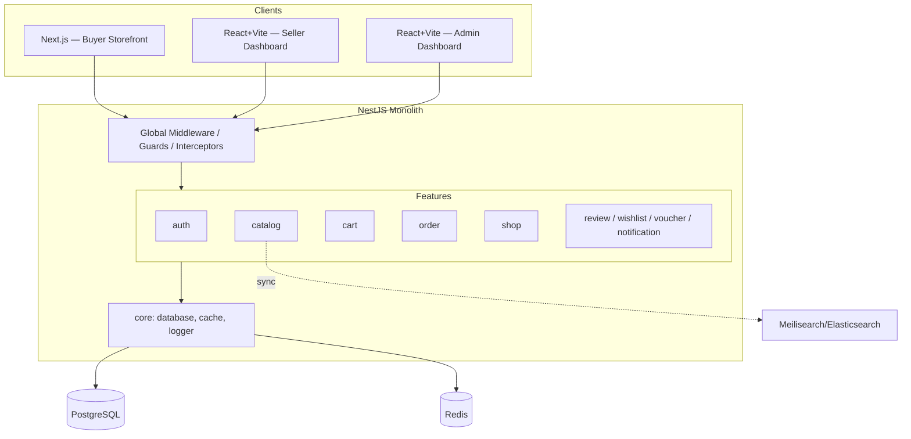
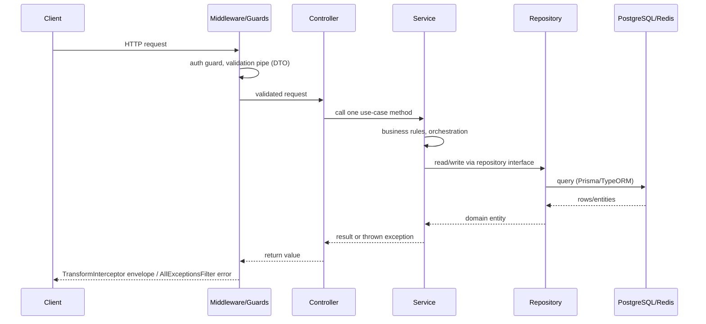
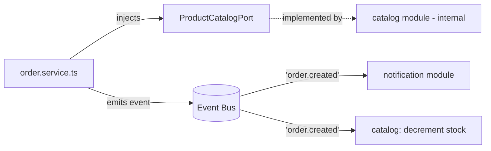

# ShopHub — Backend ARCHITECTURE.md

Companion to `DATABASE.md` (data model) and `PROJECT-RULES.md` (coding/naming rules). This doc covers structure and request flow.

---

## 1. System Overview

ShopHub's backend is a **modular monolith**: one NestJS deployable, code split by business feature rather than technical layer, so features can later be lifted into standalone services with minimal rewrite (swap in-process calls/events for HTTP/queue calls).



**Why feature-based:** a solo developer (with AI coding assistants) working across dozens of concepts (product, order, cart, shop...) benefits more from "everything about orders in one folder" than from "all controllers together, all services together." It keeps AI assistants' context windows scoped to one feature at a time, and each feature's folder is a natural extraction boundary if it later becomes its own microservice.

---

## 2. Folder Structure

```
src/
├── main.ts                      # bootstrap, global pipes/filters/interceptors
├── app.module.ts                # imports feature modules + core/config only
├── config/
│   ├── env.validation.ts        # joi/zod schema for process.env
│   └── configuration.ts         # typed config factory (app, db, redis, jwt...)
├── shared/                      # reusable, framework-level building blocks
│   ├── middlewares/             # e.g. request-id, correlation logging
│   ├── guards/                  # AuthGuard, RolesGuard
│   ├── interceptors/            # TransformInterceptor (response envelope)
│   ├── filters/                 # AllExceptionsFilter
│   ├── decorators/              # @CurrentUser(), @Roles()
│   ├── utils/                   # slugify, money formatting, pagination helpers
│   └── types/                   # shared DTOs/interfaces (PaginatedResult<T>, etc.)
├── core/                        # infrastructure wiring, not business logic
│   ├── database/                # PrismaModule/PrismaService (or TypeORM DataSource)
│   ├── cache/                   # RedisModule/RedisService (cart cache, sessions)
│   ├── logger/                  # Logger provider config (pino/winston adapter)
│   └── events/                  # EventEmitterModule / BullMQ queue setup
└── features/
    ├── auth/
    ├── user/
    ├── shop/
    ├── catalog/                 # products, categories, variants
    ├── cart/
    ├── order/                   # order_groups, orders, order_items, payments, shipments
    ├── review/
    ├── wishlist/
    ├── voucher/
    └── notification/
```

- `shared/` = generic, stateless, framework-aware helpers any feature may import.
- `core/` = infrastructure singletons (DB client, cache client, logger, event bus) that features consume through DI — not business rules.

---

## 3. Feature Anatomy

```
features/order/
├── order.controller.ts     # HTTP layer: routes, param/body decoding, calls service
├── order.service.ts        # business logic / use cases (createOrder, cancelOrder...)
├── order.repository.ts     # data access only — wraps Prisma/TypeORM calls
├── dto/
│   ├── create-order.dto.ts
│   └── order-response.dto.ts
├── entities/
│   └── order.entity.ts     # domain shape returned by repository
├── types/
│   └── order.types.ts      # internal types not shared outside the feature
├── utils/
│   └── order-code.util.ts  # e.g. order_code generator
├── order.events.ts         # emitted events: 'order.created', 'order.paid'
├── order.module.ts         # wires controller/service/repo, exports public port
├── __tests__/
│   ├── order.service.spec.ts
│   └── order.controller.spec.ts
└── context.md               # feature purpose, owner, key decisions, links to DATABASE.md tables
```

Every feature in `features/` (see `DATABASE.md` §2 for the table-to-feature mapping) follows this same shape.

---

## 4. Request Flow



| Layer | Responsibility | Must NOT do |
|---|---|---|
| **Controller** | Route mapping, DTO validation (via pipe), call one service method, return | Business logic, DB queries |
| **Service** | Business rules, orchestration across repositories/other features' ports, throws domain exceptions | Direct ORM/DB client calls, HTTP concerns |
| **Repository** | Data access only — query building, mapping rows to entities | Business rules, validation, cross-feature calls |

---

## 5. Cross-feature Communication

**Allowed:**
1. **Public port via DI** — a feature module exports a narrow interface (e.g. `PRODUCT_CATALOG_PORT`) that other features inject; the concrete `ProductService` stays private to `features/catalog`.
2. **Domain events** — `OrderModule` emits `order.created`; `NotificationModule`, `catalog` (stock decrement), etc. listen. In-process via `@nestjs/event-emitter`; move to BullMQ/Redis when a listener must not block the request or needs retry/durability.
3. **Shared service in `shared/`** — only for logic with no natural feature owner (formatting, slugs, pagination).

**Forbidden:** importing another feature's controller/service/repository/entity file directly, or querying another feature's tables straight from the ORM client bypassing its repository.



---

## 6. Shared vs Core

| | `shared/` | `core/` |
|---|---|---|
| Contains | Reusable utilities, guards, pipes, interceptors, filters, common types | Infrastructure setup: DB client, cache client, logger, event bus |
| Nature | Stateless, imported by any feature | Singleton providers, configured once, injected everywhere |
| Examples | `RolesGuard`, `TransformInterceptor`, `slugify()`, `PaginatedResult<T>` | `PrismaService`, `RedisService`, `LoggerModule`, `EventEmitterModule` |
| Owns business rules? | No | No |

---

## 7. Configuration Management

- **Environment variables:** all runtime config (`DATABASE_URL`, `REDIS_URL`, `JWT_SECRET`, `PORT`, third-party API keys) lives in `.env` (per-environment: `.env.development`, `.env.production`), never committed — `.env.example` documents required keys.
- **Config files structure:** `config/configuration.ts` exports a typed factory grouping values by domain (`{ app, database, redis, jwt, payment }`); `config/env.validation.ts` validates `process.env` at bootstrap with `joi`/`zod` — app fails fast on missing/invalid config instead of failing at first use.
- **Access pattern:** features inject Nest's typed `ConfigService` (`configService.get('database.url')`); no feature reads `process.env` directly outside `config/`.
- **Secrets handling:** secrets (`JWT_SECRET`, payment provider keys, DB password) come from the deployment platform's secret manager in staging/production (not baked into images); local dev uses `.env` excluded via `.gitignore`.

---

## [NestJS-Specific Additions]

- **DI setup:** each feature module `export`s only its public port/token, not its service class — `AppModule` composes feature modules + `core/` + `config/` globals (`ConfigModule.forRoot({ isGlobal: true })`, `LoggerModule`, `PrismaModule` marked `@Global()`).
- **Middleware chain (main.ts / AppModule):** `helmet()` → CORS → correlation-id middleware → global `ValidationPipe` → global `AllExceptionsFilter` → global `TransformInterceptor` → route handlers.
- **Module boundary enforcement:** `eslint-plugin-boundaries` (or custom `no-restricted-imports`) blocks `features/x/**` importing `features/y/{controller,service,repository,entity}` — only `features/y/*.module.ts` exports (ports) are importable.
- **Async module init:** `core/database` and `core/cache` use `forRootAsync` with `ConfigService` injection so connection strings come from validated config, not raw env.
